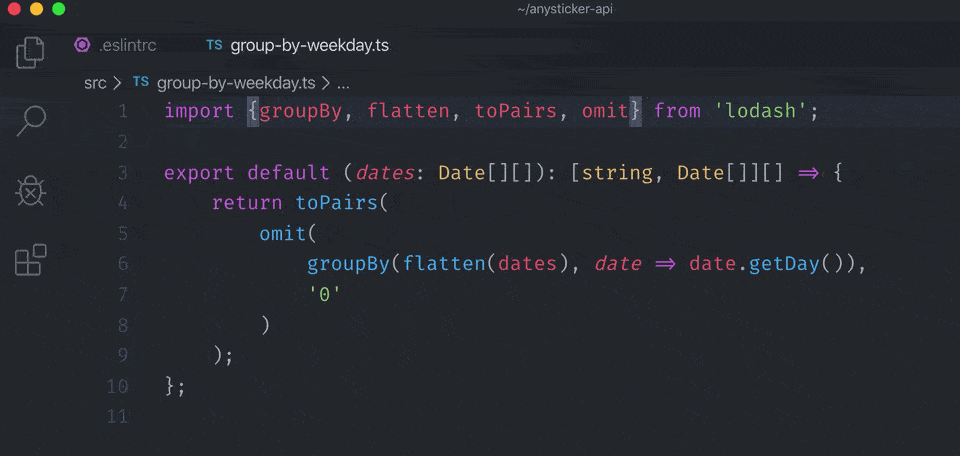

# eslint-plugin-small-import



## Disallow full import (no-full-import)
Some JavaScript libraries are a vast collection of independent helpers functions which are combined in one package, such as [`lodash`](https://lodash.com) or [`date-fns`](https://date-fns.org/). If you import one of their functions, you usually import the full suite of functions, causing higher memory consumption, startup time and bundle sizes.

The solution for this problem is to import each function directly from it's location in the package rather than the index file of the package. However, it is more tedious since more code has to be written.

### Rule details

This rule will automatically detect these cases and convert the imports. It supports `lodash`, `date-fns` and `rambda`
 out of the box, but can be configured to support more libraries as well.


### Examples

Examples of **correct** code for this rule:

```js
import sortBy from 'lodash/sortBy'
import groupBy from 'lodash/groupBy'
import format from 'date-fns/format'
import append from 'rambda/src/append'
```

Examples of **incorrect** code for this rule:

```js
import {sortBy, groupBy} from 'lodash'
import {format} from 'date-fns'
import {append} from 'rambda'
```
